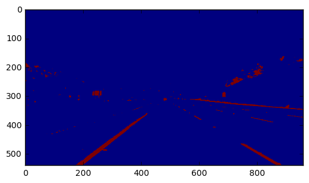
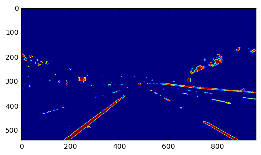
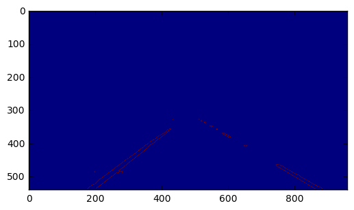
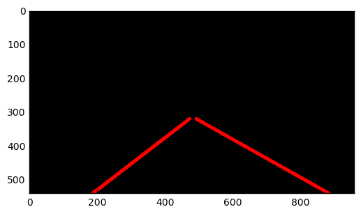
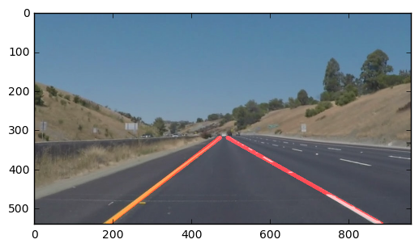

# CarND-LaneLines-P1 Project Review

In this project, how the main wrapper method find_lane_lines is developed and used is explained. Also, challenges and pitfalls of this implemenation is discussed along with some valuable lessons that was learned along the way using several tracking APIs from cv2 module.

### 1. Describe your pipeline. 

Here is a list of methods used with a brief introduction to their input, output and a highlevel functionality description.
List:
----


canny(img, low_threshold, high_threshold)
    : Applies the Canny transform similar to the notes from the online class

def grayscale(img)
    : Applies the Grayscale transform This will return an image with only one color channel and in python3 to see the returned image as grayscale you should call plt.imshow(gray, cmap='gray')

def gaussian_blur(img, kernel_size)
    : Applies a Gaussian Noise kernel to the image for speeding up the detection algorithm
    
def region_of_interest(img, vertices)
    : Applies an image mask as discussed in the online classes. The rest of the image is set to black.
    
 


def weighted_img(img, initial_img, α=0.8, β=1., λ=0.)

    :`mg is the output of the hough_lines(), which is in fact an image with lines drawn on it. There is not default value set to img.
    initial_img should be the image before any processing.
    
    The three variables are used in the following format to generate the image is which computed in the end:
    
    initial_img * α + img * β + λ
    NOTE: initial_img and img must be the same shape and this is very important for avoiding later messy errors.
    If using Python 2.7 or any other python 2 version the greek letters can throw errors.

    

*out line of find_lane_lines method*
- [x] Basic filters region_of_interest,  grayscale, canny, gaussian_blur
- [x] Basic Transformation methods Hough
 


Here is the stage by stage output from the final find_lane_lines method:
plt.imshow(grayImage)

 




The images are from the following stages respectively:

```
Filter blurGray Applied
Filter grayImage Applied
Filter masked_image Applied
Filter line_img Applied
Layer lines_edges_image Applied
```


### 2. Identify potential shortcomings with your current pipeline

The major issue was the computational time (loading). I used defuq to manage the memory but it slowed down the process rather than making the code run faster. I later switched my approached and avoided any memory management tool. Another major pitfall was using for loops in any form which slowed the process significantly.  

In  the end, I found the the tracking perfomrance to be very high even at the Yellow Left video with a lot of curved lines, seperated spaced segmented of line and higher speed the tracking is done successfully. I would like to see its performance on the challenge video as well. Still the code breaks during running for the challenge video and behaves very slowly.


### 3. Suggest possible improvements to your pipeline

There are two type of problem solvers that were used here: Trackers and Detectors.  Here are few lessons I learned along the way as the major challenges:

1. Tracking is faster than Detection. 

2. Tracking can help when detection fails. There is usually some levels of occlusion that was handled in tracking algorithms.

3. The identity of the lines was better presereved using Tracking algorithms vs detection of the line segments. I think more and more tracking methods should be applied instead of detection and line/edge detection methods. Although for the most part I used a combination of both for future work I would focus more on Tracking the lines along side a particular direction.

4. OpenCV 3.1 has implementaitons of Boosting, MIL, KF, TLD trackers. I reccommend trying this trackers on the region of interest and comparing accuracy of the detection after filters were applied.  

Simply put, locating the lines, both straight or curved, in the regeo of interest is the overal goal of this project; technically known as Object Tracking. Most of the algorithm used here is a Single Object Trackers where a class of trackers. The lines are then traked in subsequent frames using the tracking algorithms along side with line detectors and and the project involved a lot of tuning in with respect to setting up the right variables for the weight method and other filters and hough tranformation to create a basis for connecting the lines.


